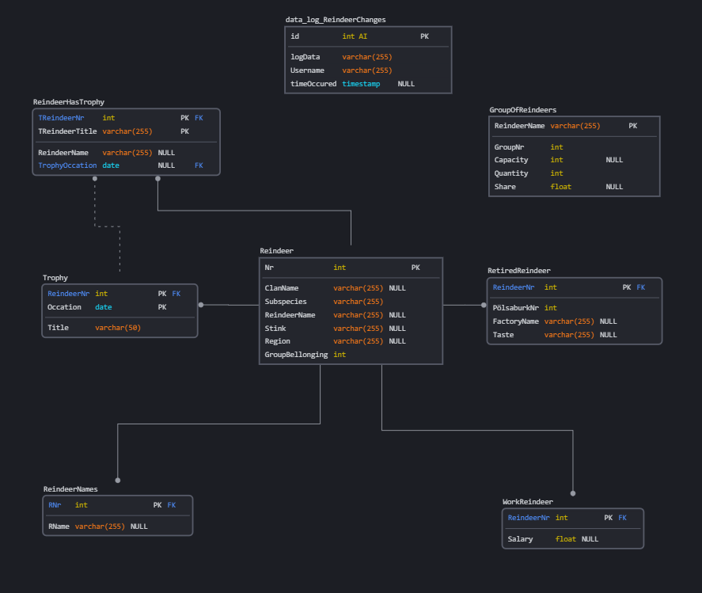
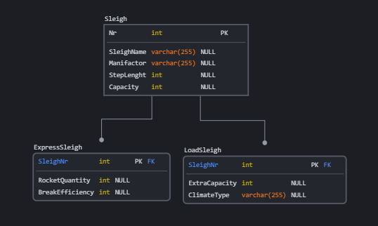
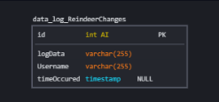

# Notes for DB-constrution Inl1

<dir>

  
    

    
<b style="color:magenta"><i>Figure 1</i>:</b> ER-diagram of Reindeer data cluster (<i>Main</i>).
</dir>

---

<dir>

  

   
<b style="color:magenta"><i>Figure 2</i>:</b> ER-diagram of Sleighs smaller data cluster.

</dir>

---

<dir>

  
    

   
<b style="color:magenta"><i>Figure 3</i>:</b> ER-diagram Individual Log entity keeping track of activity (<i>Should be able to access and stor logging data independently of class if implementing some form of Abstract entity</i>).

</dir>

---

## TESTING

---

## Requirements

    1. [x] **Minimum 2** types of views.
    2. [x]**Minimum 2** types of denormalizations.
    3. [x] **Minimum 2** types of of the total number of triggers/updates (logging/rules).

### Tasks  

    1. [x] Triggers
    2. [x] Procedures (one parameter, one without)
    3. [x] Views
    4. [ ] Index

### VG Tasks

    1. [ ] 2 Views.
    2. [ ] 2 Types of denormalizations.
    3. [ ] 2 of total number of triggers/procedures should combine multiple tasks excluding doing logging/ rule checking. 
    4. [ ] 2 new triggers or extention of existing triggers/procedures.

---

## Report

    1. [ ] Report should argument the whys/hows of the combined functionality of the work task, eg privileges, rules and logging should be combined to together prohibit unauthorized access. 

## Questions to teachers

    1. call Retire_a_Reindeer() is pepeg.
    2. Privileges.
    3. Index.
